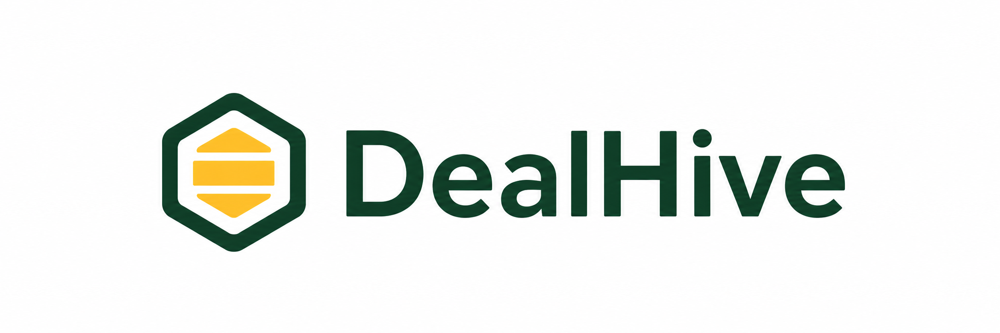

# DealHive

DealHive ist eine Web-App für Sammelkäufe im Bereich Brettspiele, TTRPGs, Tabletops und passendes Zubehör.

Künstler, Handwerker und kleine Anbieter können limitierte Angebote für Produkte wie Würfelsets, Miniaturen, Terrain, Würfeltürme oder anderes Spielzubehör erstellen. Nutzer können diesen Angeboten beitreten. Sobald genügend Personen teilnehmen, wird die Produktion ausgelöst. Bei größeren Gruppen können zusätzliche Rabattstufen freigeschaltet werden, zum Beispiel 10% oder 20%.

## Projektidee

Viele Produkte in der Brettspiel- und Tabletop-Community sind individuell, handgemacht oder nur in kleinen Mengen verfügbar. Dadurch sind sie oft teuer oder für kleine Anbieter schwer planbar.

DealHive bündelt interessierte Käufer in einem Sammelkauf. Dadurch können Anbieter besser einschätzen, ob sich die Herstellung lohnt. Gleichzeitig profitieren Käufer davon, dass größere Gruppen bessere Preise ermöglichen.

## Beispiel

Ein Anbieter erstellt ein Angebot für ein besonderes Würfelset. Die Produktion startet erst, wenn mindestens 20 Personen teilnehmen. Ab 40 Personen erhalten alle 10% Rabatt. Ab 60 Personen steigt der Rabatt auf 20%.

## Domainbezug

Der Domainbezug liegt im Bereich Brettspiele, TTRPGs, Tabletops und passendes Zubehör. Die Plattform richtet sich an eine Community, in der individuelle, limitierte oder handgemachte Produkte eine wichtige Rolle spielen.

## Verbesserungen seit der ersten Abgabe

Domainbezug, Doku nach Vorgaben

## Implementierte Features seit dem Rework der ersten Abgabe.

Im aktuellen Stand haben wir folgende zentrale Features umgesetzt:

* Registrierung und Login für Nutzer
* Rollenmodell mit Buyer und Creator
* Rollenwechsel über die Session
* Hive-Übersicht mit einfachen Filtermöglichkeiten
* Detailseite für einzelne Hives
* Beitritt zu einem Hive mit gewählter Menge
* Anzeige eigener beigetretener Hives unter „Meine Hives“
* Creator Dashboard für eigene Sammelkäufe
* Erstellung neuer Hives durch Creator
* Bearbeitung eigener Hives durch Creator
* Basispreis und Rabattstaffeln für Hives
* automatische Berechnung des aktuellen Preises anhand der erreichten Rabattstufe
* Käuferübersicht für Creator
* einfacher Chat zwischen Buyer und Creator im Kontext eines Hives
* SQLite-Datenbank mit Nutzern, Hives, Preisstaffeln, Zuordnungen und Nachrichten
* Headless JSON-API unter `/api/hives`
* lokale Demo-Datenbank und Testdaten-Skript für die First Submission
