# UI Screens – DealHive

## 1 Login Screen
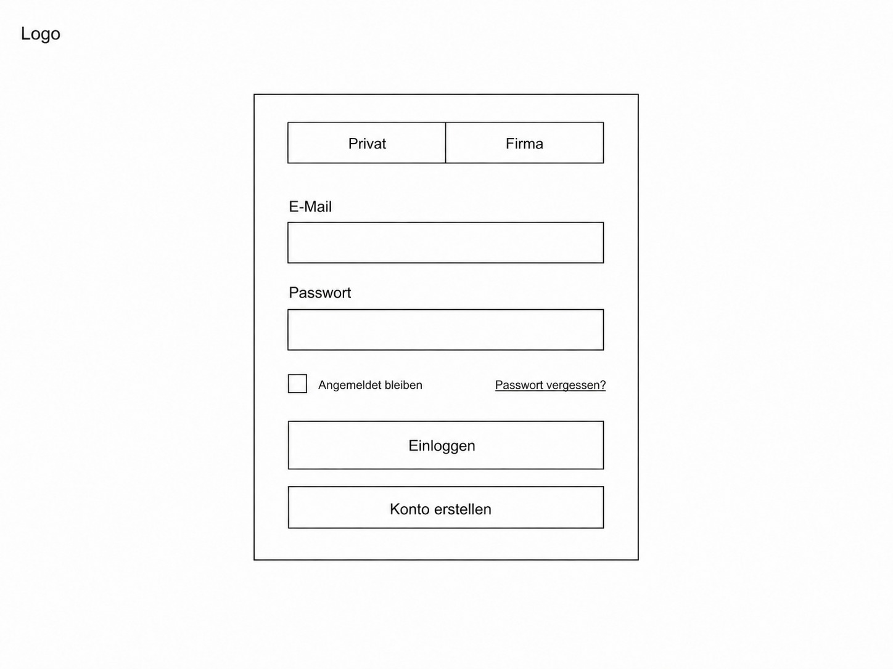

## 2 Neue Anzeige Erstellen v1
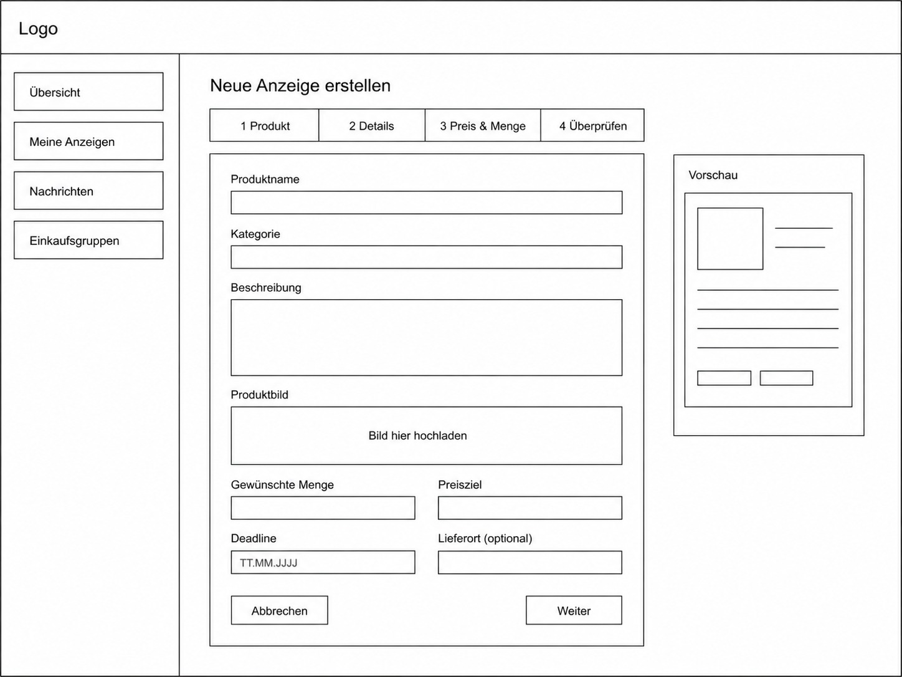

## 3 Neue Anzeige Erstellen v2
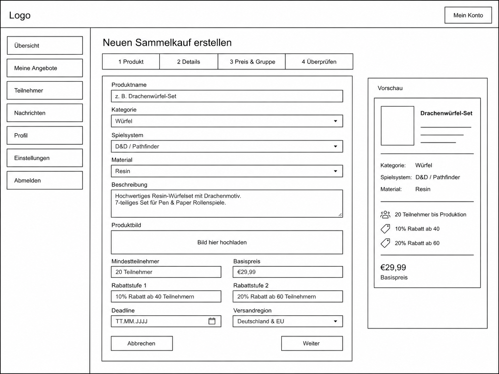

## 4 Angebote Entdecken v1
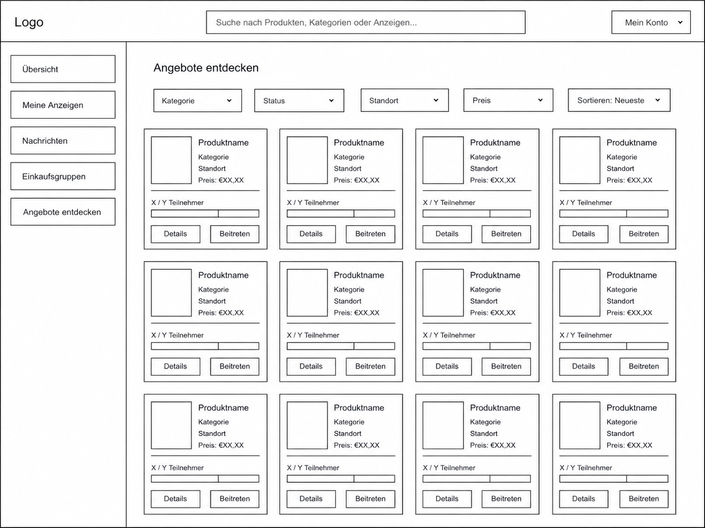

## 5 Angebote Entdecken v2
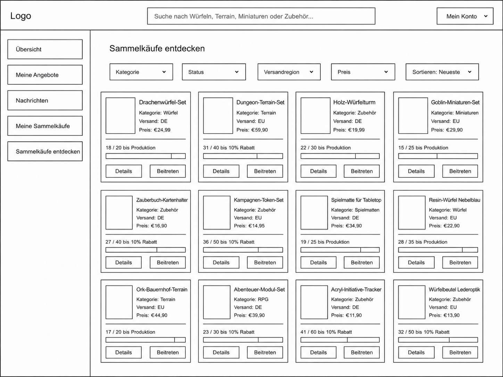

## 6 Anzeige im Detail v1
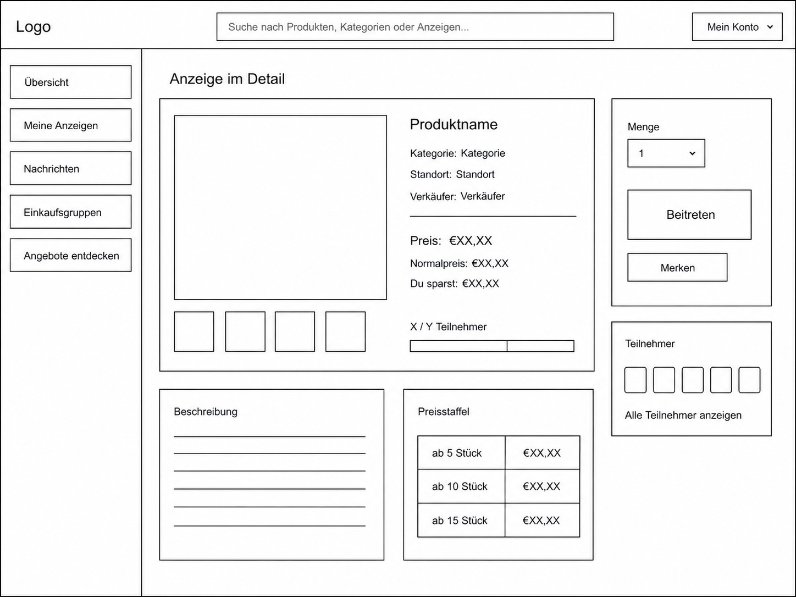

## 7 Anzeige im Detail v2
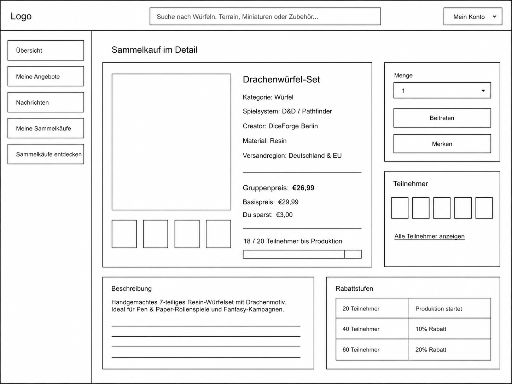

## 8 Beitritt bestätigen – Erfolgsseite
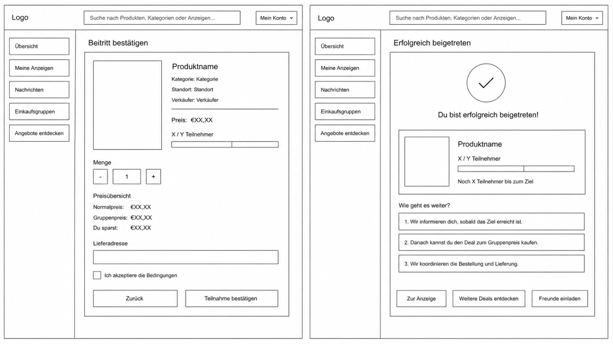

## 9 Händler Dashboard v1
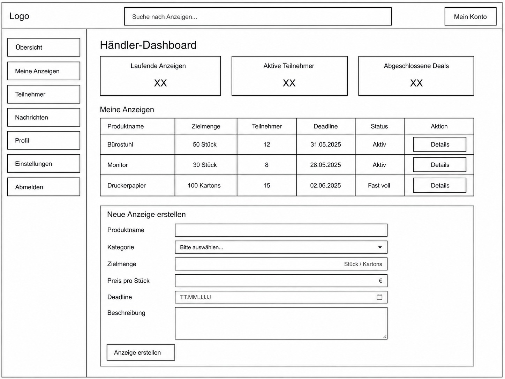

## 10 Händler Dashboard v2
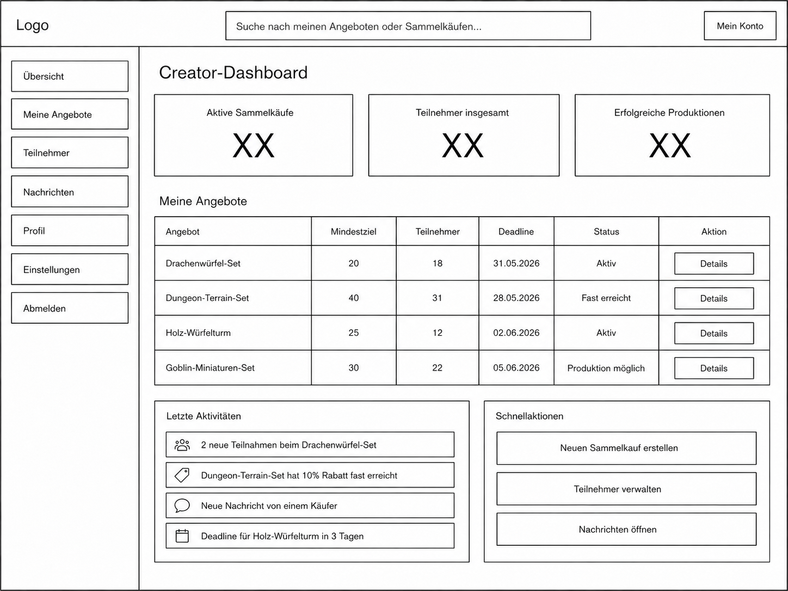

## 11 Meine Einkaufsgruppen v1
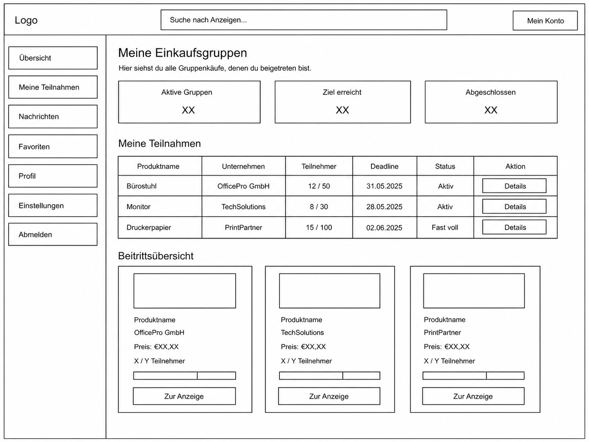

## 12 Meine Hives v2
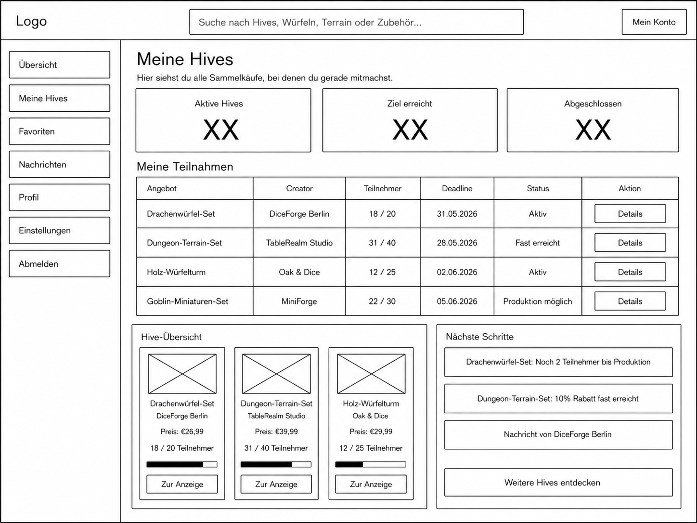